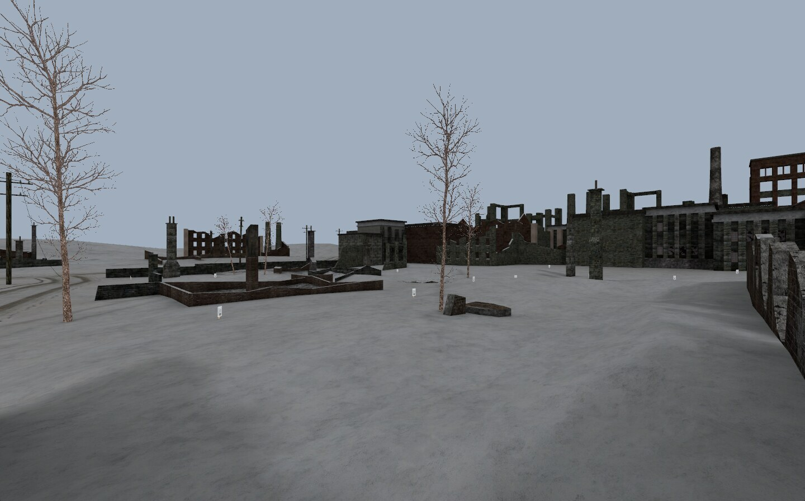
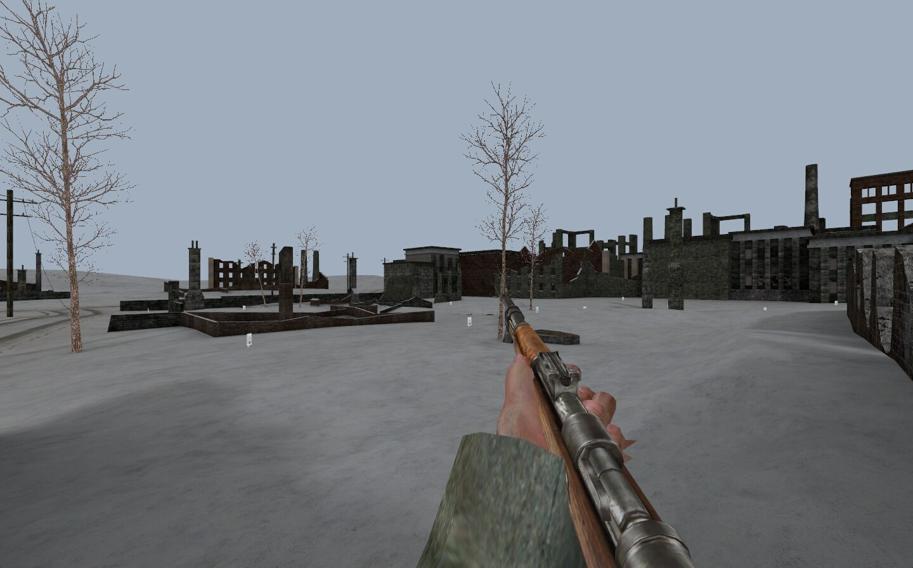
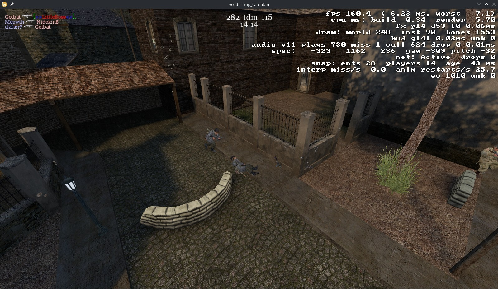

# vcod

A map viewer, spectator client and (skeleton) dedicated server for Call of
Duty (2003), patch 1.1, written in Rust. It reads the game's own pk3 archives,
renders maps with their lightmaps and props, lets you walk them with the
original movement rules, and speaks the real 1.1 network protocol well enough
to spectate a live multiplayer server with players, animations, HUD, sound and
combat effects.







## What it does today

- Loads any stock or custom map from an installed copy of the game and
  renders it textured, lightmapped, props included. Fly around freely.
- `--walk` spawns you as a soldier with Quake 3 derived movement: gravity,
  stances, stepping, wall sliding, leaning, and the kar98k viewmodel playing
  the game's own xanim clips.
- `--connect <ip:port>` joins a CoD 1.1 server as a spectator. The client does
  the handshake, Huffman coding, netchan, delta snapshots and usercmds, follows
  the server's spectator camera, and renders every player as an assembled
  soldier playing the server-driven animations. Kill feed, chat, scoreboard,
  sounds, tracers, impacts and muzzle flashes come from the same events the
  retail client reads. It downloads maps it does not have, the way the retail
  client does.
- `vcod-server` answers server browsers, accepts connections and hands out the
  gamestate, so a retail 1.1 client loads the map. It sends no snapshots yet.

The whole thing runs on wgpu and winit, so in principle it is cross-platform.
I have only run it on Linux.

It is a Cargo workspace of three crates. `crates/common` holds the file
formats, collision, movement and the 1.1 protocol, shared by the client and
the server; nothing in it imports wgpu, winit or kira. `crates/client` is the
window, renderer, HUD, effects and audio; `crates/server` is the dedicated
server. [AGENTS.md](AGENTS.md) is the contributor guide.

## Why

Mostly to see whether it could be done. Call of Duty 1 is an id Tech 3
descendant, and the Quake III Arena and Return to Castle Wolfenstein sources
are public, but the 1.1 wire protocol has never been written down. Every field
width, every enum order, every place where Infinity Ward diverged from RTCW had
to be recovered from the binaries and confirmed against the retail server.
That recovered protocol is documented in [docs/protocol-1.1.md](docs/protocol-1.1.md)
and is probably the most useful thing in here.

The other reason is that it is fun to watch a 2003 game come back to life in
a window you built yourself.

### This is an AI-driven project

Most of the code and documentation in this repository was written by an AI
coding agent working under my direction. I decide what to build, review what
comes back, run it against the real game and the retail server, and do the
pixel-level and by-ear checks the agent cannot. The research docs record for
each fact whether it was verified live or only inferred from a decompilation,
so you can tell the two apart. Treat the code as a working prototype, not a
reference implementation.

## Requirements

- A purchased, original copy of Call of Duty (2003) installed with patch 1.1.
  This repository contains no game data. The 1.5 patch ships the same
  `pak0-4.pk3` assets, so a 1.5 install also works as the asset source; the
  netcode and the reverse-engineering notes are about 1.1.
- Rust 1.90 or newer; the dependency graph requires it.
- For the client, a GPU and driver with BC (DXT) texture compression. wgpu
  picks whatever backend it finds (Vulkan, DX12, Metal, GL);
  `WGPU_BACKEND=vulkan|gl|dx12|metal` narrows the choice. The server needs no
  GPU.
- I have only tested on Linux. Windows and macOS are unverified.
- Optional, for sound: a working default output device. Without one the client
  logs a warning and runs silent.

## Building and installing

```
cargo build --release
```

builds `target/release/vcod` (client) and `target/release/vcod-server`.
`cargo build -p vcod` or `-p vcod-server` builds one of them.

The binaries expect to sit inside the game install, next to `CoDMP.exe`, and
read the paks from its `main/` subdirectory. Either copy them there, set
`COD_DIR=/path/to/CallOfDuty`, or pass `--game-dir`. `--game-dir` beats
`COD_DIR`, which beats the executable's own directory, with the working
directory as the last resort.

### Running the tests

```
COD_DIR=/path/to/CallOfDuty cargo test
```

Without `COD_DIR` the tests that need game data return early and report ok,
so a green run on a machine without the game proves nothing about the
parsers. The net-protocol tests read committed captures and run anywhere.

## Usage

```
vcod mp_pavlov
vcod mp_pavlov --walk
vcod --list
vcod --connect <ip:port>
vcod mp_pavlov --game-dir /path/to/CallOfDuty
```

- The first positional argument is the map name (case-insensitive).
- `--list` prints every `.bsp` in the search path instead of opening a window.
- `--mod-dir` selects which subdirectory's pk3s to index: `main` for retail
  CoD1 (default). `uo` for United Offensive is accepted but untested; nothing
  proves its maps load.
- `--walk` starts at a player spawn point as a collidable soldier. Needs a map
  with a spawn entity and collidable geometry.
- `--connect ip:port` spectates a live server. To find a populated one, the
  master server at `codmaster.activision.com:20510` still answers
  `getservers 1 full empty`.
- `--debug-overlay` (or F3 at runtime) shows frame time, draw stats, net and
  audio counters.
- `--no-audio` runs silent; `--volume <0..1>` sets the master volume.
- `--net-probe ip:port` is a headless client that prints what it receives and
  dumps captures to `tmp/` under the current directory. It is the netcode
  debugging tool; details in [AGENTS.md](AGENTS.md).

### Server

```
vcod-server mp_carentan --port 28960 --hostname "my server"
vcod --connect 127.0.0.1:28960
```

The server binds `0.0.0.0` and, like the retail server, answers `getstatus`
from anyone and honours an out-of-band `disconnect` by source address. Run it
on a LAN or behind a firewall you control. `--max-clients` sets
`sv_maxclients` (default 8). `--game-dir`, `--mod-dir` and `COD_DIR` work the
same way as for the client.

## Controls

Click to capture the mouse, Esc to release it, mouse to look around.

### Fly mode (default) and spectate

| Input | Action |
|---|---|
| W / A / S / D | Move forward / left / back / right |
| Space | Move up |
| Ctrl | Move down |
| Shift | Speed boost |
| Scroll | Adjust fly speed |

In spectate mode the position comes from the server; the mouse drives the look
angles. Hold Tab for the scoreboard. A map change on the server shows a loading
screen (and downloads a missing pak the way the connect does) and continues on
the new map.

These work in every mode:

| Input | Action |
|---|---|
| F3 | Toggle the debug overlay |
| F4 | Culling: on, locked (freeze the visible set), off |

### Walk mode (`--walk`)

| Input | Action |
|---|---|
| W / A / S / D | Move forward / left / back / right |
| Space | Jump (re-press to jump again, no autohop) |
| Ctrl | Crouch (held) |
| Z | Toggle prone |
| Q / E | Lean left / right |
| Shift | Slow walk |
| LMB | Fire (hitscan, leaves an impact mark) |
| RMB | Aim down sights (held) |
| R | Reload |

## Known limitations

- Shadow-decal prop models (`shadow_tree_*`, `shadow_crate` and similar) should
  draw as coplanar decals; they go through the opaque prop pipeline and show
  up as hard-edged dark patches.
- Props are lit by the compiler's per-entity `lightingPrecalc` tint, one
  colour for the whole model. The engine samples its light grid per vertex.
- No shader effects: Q3-style shader script semantics (blending, animation,
  scrolling) aren't implemented.
- Visibility follows the retail cells and portals but without the portal
  bevel planes and the brushmodel occluder volumes, so a little more is drawn
  through doorways than retail draws. Outside every cell (fly mode above the
  map) only the frustum culls, and a cell whose top is below the camera is
  frustum-culled directly: retail assumes nobody looks over a cell's walls.
- Alpha surfaces (foliage, fences) are alpha-tested only, and they collide as
  drawn, so a bush or a wire fence stops the player like a solid wall.
- Submodels (doors, exploding walls) collide by their brush hulls, but only
  as static geometry: no entity-driven movers, so there is nothing to ride.
- Bullet impacts in walk mode are one generic mark plus a smoke puff. Marks
  share the 256-entry decal ring with spectate effects; the oldest go first.
  Spectate mode picks the per-surface effect the way the retail client does.
- No mantling - which retail 1.1 MP turns out not to have either; ledge hops
  are plain jumps and step-ups (docs/research/cod11-mantle.md).
- No occlusion and no doppler: a sound through a wall is as loud as one in the
  open. The engine's same-entity channel replacement is implemented, but there
  is no priority-based voice stealing; when kira's mixer is full new sounds are
  dropped.
- Quick chat (`vsay`) is not handled. The server commands that carry it
  (`j`/`k`/`l`) are documented in [docs/protocol-1.1.md](docs/protocol-1.1.md)
  only.
- Audio fidelity is matched to the retail engine on paper (falloff, panning,
  channel replacement, ducking) but not yet confirmed by ear against the real
  game.
- The server sends no snapshots, so a connected client waits at the loaded map
  until it times out.

## Documentation

- [docs/protocol-1.1.md](docs/protocol-1.1.md): the CoD 1.1 wire protocol,
  both directions, with the list of every divergence from RTCW/Q3 at the end.
- [docs/research/](docs/research/): per-subsystem notes recovered from the
  binaries and confirmed live: the BSP, xmodel and xanim formats, the
  clientState stream, the player model and animation system, the event and
  effect tables, the efx grammar, the HUD protocol, the sound system, and the
  retail server's handshake. Each claim cites the module and address it rests
  on and says whether it was verified live or inferred.
- [tools/re/](tools/re/): the small scripts used to pull tables out of the
  binaries (event enum, netfield tables, xrefs, a Ghidra export script) and
  the disassembly notes for the Linux server.
- [AGENTS.md](AGENTS.md): working notes for contributors and coding agents:
  layout, test setup, netcode debugging, the reverse-engineering workflow.

## Lineage and inspiration

- [Quake III Arena](https://github.com/id-Software/Quake-III-Arena) and
  [Return to Castle Wolfenstein](https://github.com/id-Software/RTCW-MP) by
  id Software, GPL. CoD1 is an RTCW-MP descendant and its netcode, movement
  and animation code follow those sources closely. Where vcod ports a routine,
  the comment names the file it came from.
- [ioquake3](https://github.com/ioquake/ioq3), for a cleaner reading of the
  same netcode.
- [CoDExtended](https://github.com/xtnded/codextended), a GPL server
  extension for CoD1 1.1 whose reverse-engineered struct layouts were the
  starting point for the netfield tables.
- [cod-asset-importer](https://github.com/mauserzjeh/cod-asset-importer),
  a GPL Blender add-on for CoD assets; the xmodel triangle-strip decoder is
  ported from it and the xmodel layout was cross-checked against it.
- [wgpu](https://github.com/gfx-rs/wgpu), [winit](https://github.com/rust-windowing/winit)
  and [kira](https://github.com/tesselode/kira) for graphics, windowing and audio.

## Legal

vcod is not affiliated with or endorsed by Activision or Infinity Ward. Call
of Duty is a trademark of Activision Publishing, Inc. This repository contains
no game assets, no game code and no binaries from the game; it reads the files
of a copy you own. The reverse engineering was done to interoperate with the
game's own files and servers. The research notes document file formats and the
network protocol for that purpose: they contain layouts and addresses
recovered from the binaries, and no copied code. The screenshots above show
art owned by Activision.

Quake III Arena and Return to Castle Wolfenstein are trademarks of id
Software. Their GPL sources, and the other ported code, are credited in
[NOTICE](NOTICE).

## License

GPL-3.0-or-later; see [LICENSE](LICENSE). The network code was written with
the RTCW (GPLv3) and Quake 3 (GPLv2-or-later) sources as reference, so the
project is GPL to stay compatible with them.
