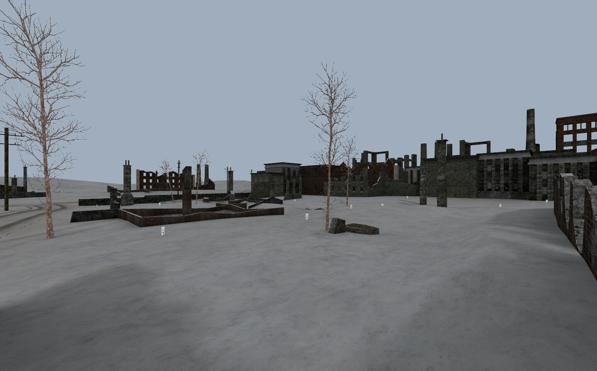
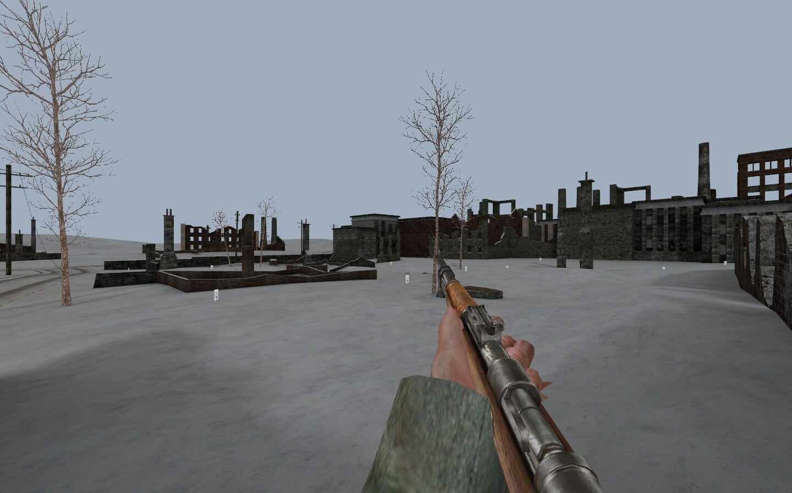
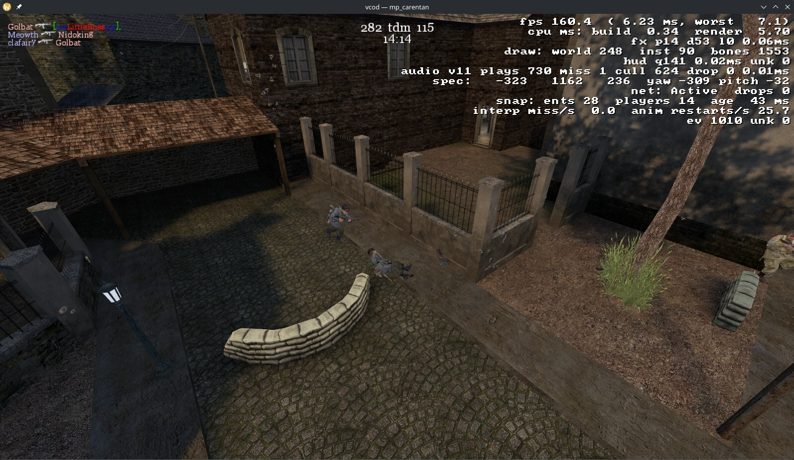

# vcod

A from-scratch reimplementation of bits of Call of Duty (2003), patch 1.1,
in Rust. A map viewer, a client that spectates and plays on real 1.1
servers, and a dedicated server a retail 1.1 client can join. It reads the
game's own pk3s and speaks the original 1.1 wire protocol, which nobody ever
wrote down, so I dug it out of the binaries.







## Read this first: it's a toy

vcod is a hobby project. I work on it while poking at a 2003 engine is fun,
and I stop when it isn't.

- **It is not a playable game.** You can run around, shoot people and plant
  a bomb, and some evenings it almost feels like Call of Duty. It is still a
  research rig with a renderer bolted on. Expect missing pieces and the
  occasional soldier living inside a wall.
- **Retail parity is not a goal.** No roadmap, no "1.0". If it ever becomes
  fully playable, that's an accident and I'll take the credit anyway.
- **It doesn't replace your copy of the game.** It needs that copy to run.
- **Don't host real players on it.** No anti-cheat, an rcon that knows a
  couple of dozen commands, and strong opinions about tick order. Your
  regulars deserve a server that was tested on someone other than bots.

If you want to play Call of Duty, play Call of Duty. If you want to watch a
2003 game boot in a window someone rebuilt from the bytes up, stick around.

## What it does

### Map viewer

- Draws any stock or custom map with textures, lightmaps and props. Skies,
  water, fences, foliage and terrain blends run through the maps' own
  Q3-style shader scripts, sun disc and fog included.
- Culls with retail's cells, portals and occluders. F4 freezes or disables
  culling so you can fly out and see what the camera was drawing.
- Plays the map's ambient loop.

### Walk mode (`--walk`), offline

- Spawns a soldier on a spawn point with retail movement: gravity, crouch,
  prone, stepping, leaning, wall sliding.
- Seven weapons with their own viewmodels, animations, sounds and reserve
  ammo. Hitscan shots with per-surface impacts and tracers.
- Footsteps on retail's cadence per surface; the landing sound scales with
  fall speed.

### Client

- Opens on the stock main menu and server browser, drawn from the game's own
  `ui_mp/*.menu` files. The browser's three sources are retail's: Local
  (a `getinfo` broadcast to ports 28960-28963), Internet (what
  `codmaster.activision.com` knows) and Favorites (kept in `servercache.dat`
  beside `CoDMP.exe`, the file retail uses). It pings, filters, sorts by
  column, joins on double-click, and runs the stock password, server info,
  filter and favourite popups. Losing the server drops you back on the menu
  with the localized reason in the stock error popup.
  In a game, Esc opens the script menu and its Main Menu tab the stock
  in-game main menu (Back to Game, Disconnect). The stock Mods menu lists
  the mod directories beside `main/` and switches to one, in a game too,
  and the menus load from the mod's own `ui_mp/menus.txt`.
- The stock Options and Multiplayer Options screens: rebind keys, mouse
  sensitivity and invert, player name, rate, master volume, video mode and
  full screen. Choices land in the console's binds and cvars and persist in
  `vcod_mp.cfg`; settings vcod has no use for are kept but do nothing.
- Joins a 1.1 server (`--connect` or the browser): handshake, Huffman,
  netchan, delta snapshots, and pak downloads for whatever the server has and
  you don't, matched by checksum as retail does. Pure servers take its pak
  checksums. Modded servers work too: a server's `fs_game` layers its mod
  directory over `main/` and swaps in the mod's menus, its
  `cl_allowDownload` decides whether to download, and a mod's script menus
  and `hud.menu` text show up.
- Answers the stock team and weapon menus as a keyboard list built from
  their `.menu` files, or straight from `--team` and `--weapon`.
- **Spectates.** Every player is an assembled, animated soldier. Kill feed,
  chat, scoreboard, sounds, tracers, impacts and muzzle flashes come off the
  same events retail reads.
- **Plays.** Move, jump, crouch, prone, lean, fire, aim down the sight,
  reload, melee, use, switch weapons, on retail's default binds. A usercmd
  is built every 8 ms, like a 125 fps retail client, and they go out at
  retail's `cl_maxpackets` 30 with `cl_packetdup` 1 off the LAN.
- Predicts your movement by replaying unacknowledged cmds through the same
  step the server runs. A correction eases out over 100 ms.
- Draws and stamps cmds on retail's client clock, which slews a millisecond
  or two per snapshot instead of stepping on jitter; `cl_timeNudge` works.
- First-person weapon with your team's hands, sight zoom at the weapon's FOV,
  sniper scope overlay that follows the sway and the hit kick, and your own
  fire, reload and footstep sounds played off the prediction.
- Fire recoil off the weapon file's view and gun kick keys: the view kick
  rides your cmd angles, as retail's does, rolls the view with it, springs
  back to centre and clears on a respawn.
- Mounted MG42s with their fire anim and flash; on the gun the view rides
  `tag_player` and the crosshair turns into the gun's reticle.
- The HUD the stock `hud.menu` lays out: crosshair that opens with spread,
  health, ammo, stance, compass with objectives and teammates, use hints, hit
  direction, chat and announcements. Also the gametype script's own HUD
  elements (S&D clock, bomb icons, progress bar) in retail's fonts, and head
  icons over players. A spectator following someone sees their HUD, weapon
  and scope.
- Follows the server through a map change: loading screen, downloads, new
  map.
- Retail's drop-down console on `` ` ``. It takes the commands under
  [Console](#console); binds and archived cvars persist in `main/vcod_mp.cfg`.

I have played it against my own server and the retail Linux 1.1d server, and
spectated public servers with it. I haven't joined a public server as a
player, and neither should you. Those people signed up for Call of Duty, not
for my test suite.

### Dedicated server (`vcod-server`)

- Answers server browsers, accepts retail 1.1 clients, sends the gamestate
  and delta snapshots.
- Runs Activision's own gametype and map scripts on `vcod-gsc`, a VM for
  CoD's `.gsc` language that lives in this repo. Menus, spawns, scoring,
  rounds and limits all come from the stock scripts, not from Rust. All five
  stock gametypes are checked against retail: `dm`, `tdm` and `sd` end to
  end, `re` and `bel` through their key events
  ([cod11-gametypes-re-bel.md](docs/research/cod11-gametypes-re-bel.md)).
- Shared pmove with capsule players that block and push each other. Falls
  stun and hurt.
- Bullets trace the world, players and static props, through the stock
  damage callback with per-bone hit locations. Rifle rounds go through
  players, every round goes through glass. Melee works. Grenades are real
  missiles that bounce, rest and explode with retail's falloff, and a blast
  walks its victims in retail's area-tree order, so the guy in front still
  eats it for the guy behind.
- Corpses in the eight-slot body queue, dropped weapons, pickups by touch or
  use key, items that fly retail's arc and respawn on its timer.
- Search & Destroy end to end: plant, defuse, progress bar, compass
  objectives.
- Mounted MG42s: mount, aim inside the arc, fire, dismount.
- Map triggers, script movers that carry and shove players and items, and
  `linkTo` on script models, brush models, items, turrets and player tags.
- Intermission, `map_restart` and `sv_mapRotation` the way retail runs them.
- Spectator follow and the killcam, replayed from a ring of archived frames.
- rcon with retail's commands and replies, bans, the master heartbeat,
  zombie slots and retail-measured pings.
- Publishes retail's pak lists and checksums in the systeminfo, serves the
  paks it lists to clients that lack them at retail's pace, and with `--set
  sv_pure=1` checks each client's pak checksums the way a pure retail server
  does. `sv_minPing`/`sv_maxPing` refuse off-LAN clients by challenge ping,
  and an off-LAN client's messages wait out its rate and `snaps`. Big
  messages, the gamestate included, go one fragment per frame.
- `--bots` adds bots that join through the stock menus and roam a nav graph
  built from pmove runs, ladders and jumps. They play the objectives: S&D
  plants and defuses, Retrieval carries and escorts, Behind Enemy Lines
  hunts. With `--bots-shoot` they fight back, with a reaction delay, a turn
  cap and aim that settles on target. They are still bad at it. So am I.

## How I know it's right (when it is)

The retail 1.1d Linux server is the oracle. When vcod and retail disagree,
retail wins and the disagreement goes into a research doc.

- A headless probe client (`vcod --net-probe`) joins a server and records
  what it sees, with a few dozen scripted modes: shoot someone, throw a
  grenade, plant the bomb, crawl prone up a hill, get stuck inside another
  player.
- The retail recordings are committed as fixtures. A/B tests replay the same
  inputs on vcod's server and diff the result snapshot by snapshot.
- Small `.gsc` probes run on retail and on `vcod-gsc`, and the suite compares
  their output.

This catches a lot. Anything about how it looks or sounds still needs a human
squinting at a screen.

## What it doesn't do

Retail does a lot more than this list. These are the gaps you'll hit first.

**Front end.** Main menu, browser and its popups, options, quit and error
popups work. On the options screens only binds, sensitivity, invert mouse,
name, rate, volume, video mode, full screen, brightness and the crosshair
and HUD toggles take effect; texture, lighting, sound quality and language
settings are stored but ignored. Show Compass and Team Overlay do nothing,
as in retail 1.1. Start New Server and CD key print "not in vcod
yet". The browser's game type filter, map preview and refresh date are
missing.

**Client**

- Protocol 1 (patch 1.1) only. 1.5 and United Offensive servers won't talk
  to it.
- Prediction carries you on a moving brush model but not its rotation.
  Neither does retail's.
- A mod's UI DLL is ignored; only its menu files count
  ([cod11-front-end.md](docs/research/cod11-front-end.md) sections 16-17).
  Switching mods in a game keeps the loaded map's geometry.

**Server**

- An entity linked to a player tag sits within a few units of retail's spot
  and doesn't follow the body after `setPlayerAngles`. A tag on an `attach`ed
  model can't take a link.
- A brush model that turned and turned back keeps a sliver of yaw on retail
  and drifts its riders about 0.02 units a frame. vcod's comes back to zero.
  Yes, I'm calling that a bug in retail.
- `sv_pure` defaults to 0 where retail's default is 1, and a client may
  download only the paks the server lists. Retail serves any file under its
  directories, `..` included, so I'm keeping that one on purpose.
- rcon runs `map`, `devmap`, `map_restart`, `map_rotate`, `status`,
  `clientkick`, `kick`, `banUser`, `banClient`, `dumpuser`, `serverinfo`,
  `systeminfo`, `say`, `set`, `seta`, `cvarlist`, cvar queries, `heartbeat`,
  `killserver` and `quit`. Not `gameCompleteStatus`, `scriptUsage` or
  `stringUsage`. Bans live in vcod (`--ban-file` keeps them across runs)
  where retail hands them to Activision's authorize server. Like retail's, a
  ban refuses an address off the LAN and leaves the banned player connected
  until they leave on their own. After `killserver` the process sits there
  deaf, since there is no stdin console.
- A heartbeat reaches the master, which probes back. I haven't seen vcod
  listed yet.

**Rendering and sound**

- Props are lit per vertex from the map's lights and its light-visibility
  grid at load, as retail does. Dynamic lights add on top with retail's
  falloff instead of competing for a prop's eight light slots. Players,
  other entity models and the viewmodel pick their eight lights from the
  grid every frame, fx lights among them
  ([cod11-light-grid-and-leaf-lights.md](docs/research/cod11-light-grid-and-leaf-lights.md)).
- Only the ocean's `deformVertexes wave` moves; the other forms parse and do
  nothing. NV/ATI hardware-path stages are dropped, as retail did on cards
  without them. `$dlight` and the ship's deckflag have no file behind them,
  so stand-ins draw
  ([cod11-shader-scripts.md](docs/research/cod11-shader-scripts.md)).
- Visibility draws a bit more than retail on purpose. Retail assumes nobody
  looks over a cell's walls, and the mp_ship decks disagree.
- Audio follows the engine on paper (falloff, panning, voice pools, stealing,
  ducking) but hasn't been checked by ear against the real game. Wall
  occlusion is a vcod addition.

**Things that look like gaps and aren't**

- No mantling, no swimming. Retail 1.1 MP has neither
  ([cod11-mantle.md](docs/research/cod11-mantle.md)).
- No grenade cooking. The fuse runs in full from the release, however long
  you clutched it.
- No doppler. The 1.1 engine never gives a sound a velocity.
- Quick chat (`vsay`) does nothing on a stock install, same as retail: its
  `.voice` tables only ship in mods.
- Asphalt footsteps are silent in retail because the engine asks for
  `asphalt` and the sound table spells it `asphault`. vcod uses the table's
  spelling, so you can hear asphalt. Twenty-three years late, Infinity Ward,
  you're welcome.

## Requirements

- A purchased copy of Call of Duty (2003) with patch 1.1. This repo has no
  game data. Patch 1.5 ships the same `pak1-4.pk3` and a different
  `pak0.pk3`; a 1.5 install works as the asset source, but its `pak0` is
  not on a pure 1.1 server's list. The netcode is 1.1 only.
- Rust 1.90 or newer.
- For the client, a GPU with BC (DXT) texture compression. wgpu picks a
  backend; `WGPU_BACKEND=vulkan|gl|dx12|metal` narrows it. The server needs
  no GPU.
- Linux is the only platform I run. Windows and macOS builds exist and are
  untested, so godspeed.
- An audio device if you want sound. Without one the client warns and runs
  silent.

## Building

Prebuilt Linux amd64, Windows amd64 and macOS arm64 binaries are on the
[nightly release](https://github.com/janost/vcod/releases/tag/nightly),
rebuilt from `master` on every push that touches code. It's a rolling tag:
the assets are replaced in place and the previous build is gone.

```
cargo build --release
```

gives `target/release/vcod` and `target/release/vcod-server`. Both expect to
sit next to `CoDMP.exe` and read the paks from `main/`. Copy them there, set
`COD_DIR=/path/to/CallOfDuty`, or pass `--game-dir`. `--game-dir` beats
`COD_DIR`, which beats the executable's directory.

```
COD_DIR=/path/to/CallOfDuty cargo test
```

Without `COD_DIR` the tests that need game data return early and pass, so a
green run without the game proves nothing about the parsers. CI runs that
way, because it can't ship the game either.

## Usage

### The closest thing to a game

```
vcod-server mp_carentan --bots 4 --bots-shoot
vcod --connect 127.0.0.1:28960
```

Pick a team, pick a weapon, go get shot by a bot.

### Client

```
vcod                                   # main menu and server browser
vcod mp_pavlov                         # fly
vcod mp_pavlov --walk                  # walk, offline
vcod --list                            # every .bsp in the search path
vcod --connect <ip:port> --team axis --weapon kar98k_mp
```

- The map name is case-insensitive.
- `--team <allies|axis|autoassign|spectator>` and `--weapon <file>` answer
  the menus without showing them, for `--connect` and every console
  `connect`. If the menu refuses the weapon, you pick by hand.
- `--mod-dir uo` indexes United Offensive's pk3s instead of `main/`. One
  directory mounts at a time, so a UO map whose art lives in `main/` shows
  missing textures. I've flown noville this way. Anything else in UO is
  untested.
- `--debug-overlay` (or F3) shows frame, draw, vis, net and audio counters.
- `--no-audio` runs silent; `--volume <0..1>` sets the master volume
  (`mss_volume`, default 0.8, also on the Sound screen).
- `--net-probe <ip:port>` is the headless probe client; `vcod --help`
  documents its modes.

### Server

```
vcod-server mp_carentan --port 28960 --hostname "my server" --gametype tdm
```

- Binds `0.0.0.0` and answers `getstatus` from anyone, like retail. Keep it
  on a LAN or behind a firewall you control.
- `--gametype` picks the script under `maps/mp/gametypes/` (default `dm`);
  `--max-clients` sets `sv_maxclients` (default 8).
- `--set NAME=VALUE` is retail's `+set`, repeatable:
  `--set scr_friendlyfire=1`, `--set sv_mapRotation="..."`.
- `--set rconPassword=<pw>` turns rcon on.
- `--set g_password=<pw>` makes the server private, checked as retail does
  at connect, `map_restart` and map change.
- `--set sv_privateClients=N --set sv_privatePassword=<pw>` reserves the
  first N slots for clients that send that password, as retail does.
- `dedicated` defaults to 1, not retail's 2, so dev runs stay off the master
  list. `--set dedicated=2` heartbeats `codmaster.activision.com` every three
  minutes and sends a flatline on Ctrl-C or `quit`.
- `--bots <n>` adds `n` bots in real client slots. The nav graph builds on
  its own thread on the first tick (a second or two on big maps); bots
  wander until it's ready. `--bots-shoot` lets them fight.
- `--gametype-script <file>` runs a gametype from disk instead of the paks.
- `--test-entities <n>` adds invisible entities that move on the wire, to
  exercise the entity encoding.
- `--trace` logs every snapshot per client, and once a second the slowest
  tick and how far the loop fell behind its 20 Hz schedule.

## Controls

Click to capture the mouse, Esc to release it.

### Fly mode

| Input | Action |
|---|---|
| W / A / S / D | Move |
| Space / Ctrl | Up / down |
| Shift | Speed boost |
| Scroll | Fly speed |

### Playing

The stock `config_mp.cfg` binds, with the sight on the right mouse button as
`+speed`. `bind MOUSE2 "toggle cl_run"` makes the sight a toggle.

| Input | Action |
|---|---|
| W / A / S / D | Move |
| Space | Stand up; jump when standing |
| C / Ctrl | Crouch / prone |
| Q / E | Lean (held) |
| LMB | Fire (semi-autos fire once per click) |
| RMB | Aim down the sight (held) |
| R | Reload |
| Shift | Melee |
| F | Use: pick up, mount an MG, plant, defuse, respawn |
| 1 / 2 / 3 / 4 | Primary, second primary, pistol, grenade |
| Scroll | Next / previous weapon |
| Tab | Scoreboard (held) |
| T / Y | Chat to everyone / your team |
| M | Script menu: team, or weapon once you have a team |
| Esc | Script menu, as retail; its Main Menu row opens the main menu (Back to Game, Disconnect, Quit) |

With a script menu open, digits pick a row, Up / Down and Enter navigate,
and Esc closes it. The main menu takes the mouse; Esc or Back to Game
returns to the game. As a spectator, Space rises and C sinks.

### Walk mode

| Input | Action |
|---|---|
| W / A / S / D | Move |
| Space | Jump (no autohop) |
| Ctrl | Crouch (held) |
| Z | Toggle prone |
| Q / E | Lean |
| Shift | Slow walk |
| LMB / RMB | Fire / aim down sights |
| R | Reload |
| 1-7 | colt, thompson, mp40, mp44, enfield, kar98k, scoped kar98k |

### Console

`` ` `` or `~` toggles it; while it's down the game gets no keys. Up / Down
walk history, Tab completes, Page Up / Page Down scroll. In game, a line
without a leading `/` or `\` is chat, as in retail. `;` separates commands.

| Command | Does |
|---|---|
| `connect <ip:port>`, `disconnect`, `reconnect`, `quit` | What they say |
| `say`, `say_team` | Chat |
| `cmd <text>` | Send a raw client command |
| `bind`, `unbind`, `unbindall`, `bindlist` | Binds |
| `set`, `seta`, `toggle`, `<cvar> [value]` | Cvars; `seta` also saves |
| `cvarlist`, `cmdlist`, `echo`, `clear` | The usual |

Anything else goes to the server while connected (`callvote`, `kill`,
`follownext`). Bindable commands and key names are retail's (`+attack`,
`+speed`, `weaponslot pistol`, `MOUSE1`, `MWHEELUP`). The client cvars are
`name`, `cl_run`, `sensitivity`, `m_yaw`, `m_pitch`, `cg_fov`
(cheat-protected, so 80 unless the server runs `sv_cheats 1`), `rate`
(25000; retail's first-run 5000 starves snapshots), `snaps`,
`scr_conspeed`, `mss_volume`, `r_mode` / `r_fullscreen` (applied at start
and by `vid_restart`), `password` and the browser's `ui_netSource` and
`ui_browserShow*`. `exec <file>` runs a config from the paks or `main/`.
Binds only act while connected.

### Main menu and browser

Mouse to pick, double-click or Enter to join, wheel or Page Up / Down to
scroll, Esc to go back. Click Source to cycle Local, Internet and Favorites.
On a bind, click or Enter, then press the new key (Esc cancels, Backspace
clears); a third key replaces both of the old ones. Click a text field to
type into it; Enter, Tab or Esc finishes.

### Everywhere

| Input | Action |
|---|---|
| `` ` `` / ~ | Console |
| F3 | Debug overlay |
| F4 | Culling: on, locked, off |

## Documentation

- [docs/protocol-1.1.md](docs/protocol-1.1.md): the 1.1 wire protocol, both
  directions, with every divergence from RTCW/Q3 at the end.
- [docs/research/](docs/research/): about thirty documents on file formats,
  movement, combat, items, turrets, movers, HUD, sound, script semantics,
  the console, the front end, bots and more. Every claim names the module and
  address it rests on and says whether it was verified against a binary or
  capture, or inferred. I'd call this the most useful part of the repo.
- [tools/re/](tools/re/): the scripts that pull tables out of the binaries,
  and the Linux server disassembly notes.
- [AGENTS.md](AGENTS.md): the contributor guide. Layout, measuring against
  retail, and the traps I already paid for.

The code is four crates: `vcod-common` (formats, collision, movement,
protocol; no GPU or audio), `vcod` (client), `vcod-server` and `vcod-gsc`
(the script VM, which depends on nothing else here).

## Some numbers, for fun

As of October 2026:

- about 173,000 lines of Rust,
- about 2,200 tests,
- about 270,000 words of protocol and research notes, longer than most novels
  and with a worse plot, except the twist where grenade cooking turned out
  not to exist,
- one asphalt footstep restored.

## Why

Mostly to see whether it could be done. CoD 1 descends from id Tech 3, and
the Quake III and RTCW sources are public, but the 1.1 wire protocol was
never documented. Every field width, enum order and place Infinity Ward
wandered off from RTCW had to come out of the binaries and be confirmed
against the retail server. Also, watching a 2003 game come back to life in a
window you built yourself is a lot of fun.

### This is an AI-driven project

An AI coding agent wrote most of the code and docs here, under my direction.
I decide what to build, review what comes back, run it against the real game
and the retail server, and do the pixel and by-ear checks the agent can't.
The research docs label each fact verified or inferred so you can tell them
apart. Treat the code as a working prototype, not a reference
implementation.

## Lineage and inspiration

- [Quake III Arena](https://github.com/id-Software/Quake-III-Arena) and
  [Return to Castle Wolfenstein](https://github.com/id-Software/RTCW-MP) by
  id Software, GPL. CoD1 descends from RTCW-MP, and its netcode, movement and
  animation code follow those sources closely. Where vcod ports a routine,
  the comment names the file it came from.
- [ioquake3](https://github.com/ioquake/ioq3), for a cleaner reading of the
  same netcode.
- [CoDExtended](https://github.com/xtnded/codextended), a GPL server
  extension for CoD1 1.1 whose struct layouts were the starting point for the
  netfield tables.
- [cod-asset-importer](https://github.com/mauserzjeh/cod-asset-importer), a
  GPL Blender add-on. The xmodel triangle-strip decoder is ported from it.
- [wgpu](https://github.com/gfx-rs/wgpu),
  [winit](https://github.com/rust-windowing/winit) and
  [kira](https://github.com/tesselode/kira) for graphics, windowing and
  audio.

## Legal

vcod is not affiliated with or endorsed by Activision or Infinity Ward. Call
of Duty is a trademark of Activision Publishing, Inc. This repository
contains no game assets, game code or binaries; it reads the files of a copy
you own. The reverse engineering was done to interoperate with the game's own
files and servers. The research notes document file formats and the network
protocol for that purpose: layouts and addresses recovered from the
binaries, no copied code. The screenshots show art owned by Activision.

Quake III Arena and Return to Castle Wolfenstein are trademarks of id
Software. Their GPL sources, and the other ported code, are credited in
[NOTICE](NOTICE).

## License

GPL-3.0-or-later; see [LICENSE](LICENSE). The network code was written with
the RTCW (GPLv3) and Quake 3 (GPLv2-or-later) sources as reference, so the
project is GPL to stay compatible with them.
